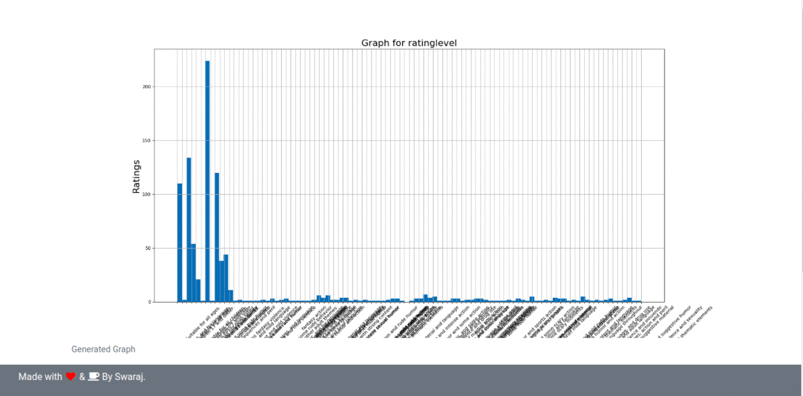

# Data Visualizer

Using this webapp you can filter CSV files and also visualize the results.

## Prerequisites

You must have python installed on your machines.  

[python](https://docs.python-guide.org/starting/install3/linux/)  

Apart from python, you will need following packages to run this.


[pandas](https://pandas.pydata.org/docs/getting_started/install.html)  
[matplotlib](https://matplotlib.org/users/installing.html)  
[flask](https://flask.palletsprojects.com/en/master/installation/)  

## Installation

Once you have installed all the dependencies you simply need to clone the repository to your local machine using 
```git
git clone git@github.com:Swaraj-Deep/data_visualizer.git
```

## Usage

Once the repository is cloned, move to the Data Visualization directory and run the [main.py](/Data%20Visualization/main.py) file using following command

```bash
python3 main.py
```

Now copy the address from the command line and paste it in the browser.

## Screen shots





## Future Scope

Can be extend to serve web APIs. The Graph images can be more refined and more types of graphs can be added. More criterias can be added to filter the data.

## Contributing
Pull requests are welcome. For major changes, please open an issue first to discuss what you would like to change.

## License
[MIT](https://opensource.org/licenses/MIT)
